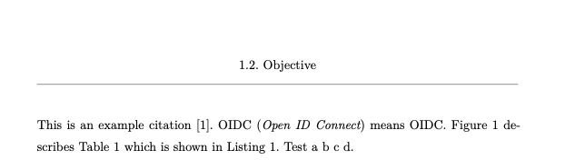
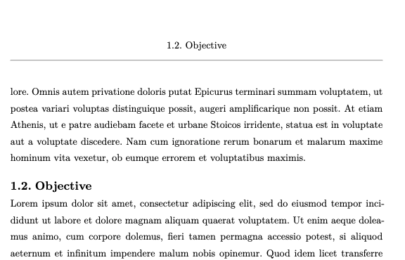
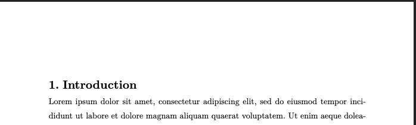

# This repo is archived in favor of [AnsgarLichter/unofficial-hka-thesis](https://github.com/AnsgarLichter/unofficial-hka-thesis)

---

# Typst Template HKA 

This is a thesis template written in [Typst](https://typst.app/), 
based on the [template of the TU Munich](https://github.com/ls1intum/thesis-template-typst).

## Getting Started
Refer to to [Typst's Tutorial and Documentation](https://typst.app/) to setup your environment.

### Features

## Metadata
In the file `metadata.typ` you can enter all metadata (title, author, submission date, ...). The data is automatically referenced in the exposé and the thesis.

## Settings
Some important global settings are located in `settings.typ`. You can adapt them here as you wish and they are automatically changed in the exposé and the thesis.

## Pre-defined Pages
The template supports the following pages out-of-the-box:

- Titlepage
- Declaration of Originality
- Abstract, both in English and German
- Table of Contents
- List of Figures
- List of Tables
- List of Listings
- List of Abbreviations (for instructions refer to [glossarium](https://github.com/typst/packages/tree/main/packages/preview/glossarium/0.2.6))
- Bibliography

# **Usage of official Titlepage**
In the intranet you can download the official titlepage. As Typst is not able to include PDFs you must manually exchange the current titlepage with the official in the final PDF file.

## Header
Every header includes the heading of the current chapter, section or subsection. 

If a new section or subsection starts at the current page this one is chosen. 

If a new chapter starts at the current page, no header will be shown.

The numbering is shown thanks to the inspiration from [hydra](https://github.com/tingerrr/hydra) (Hydra didn't work flawlessly, therefore I had to write my own solution).

## Footer
Every footer is divided by a line from the main body. The footer contains the page numbering in the following format `1 / 3`. If you want to change these, you have to adapt the corresponding section in the `template.typ`.

## 💡 Feedback

**Anything Missing?** Please [create an issue](https://github.tools.sap/I573017/hka-thesis-template/issues/new) or open a Pull Request right away.

**Have Questions?** Please [open a discussion](https://github.tools.sap/I573017/hka-thesis-template/discussions).